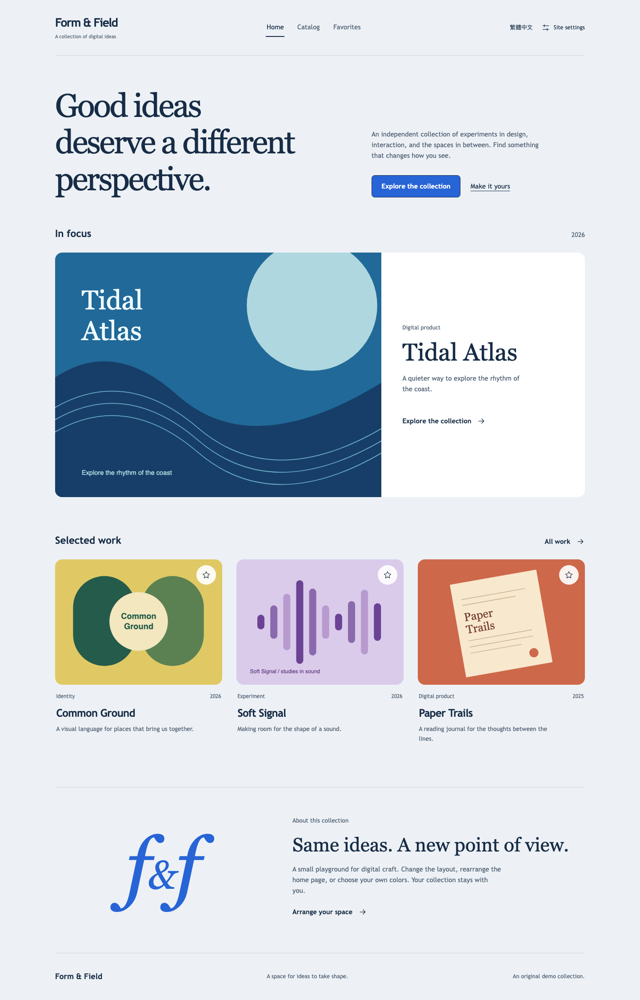
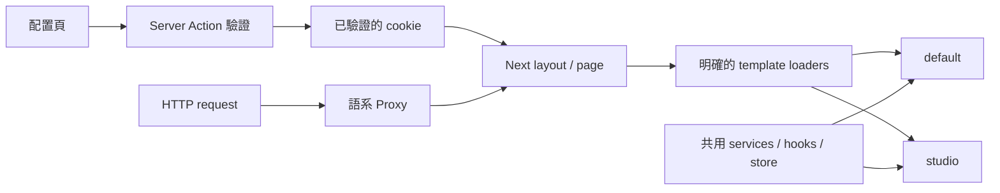
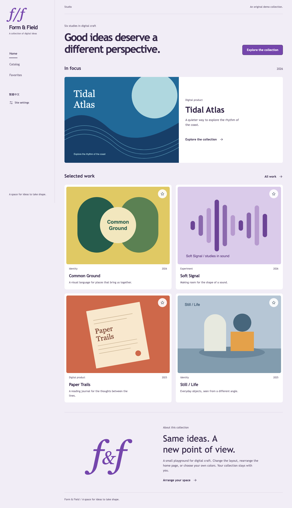
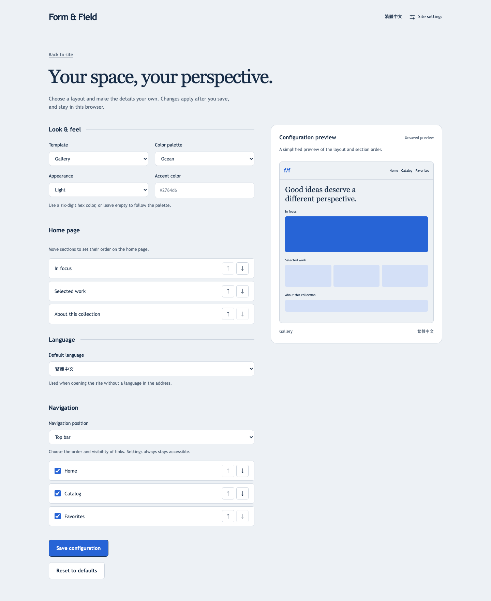

# Form & Field — Next.js Multi-template Portfolio

以 **Next.js 為核心**的多版型架構作品：同一套路由、資料與功能，套用不同布局；透過獨立配置頁調整版型、配色與內容，並由伺服器讀取 cookie 產生初始畫面。

A server-rendered portfolio playground with interchangeable layouts, shared features, and cookie-backed configuration.



## 可以試什麼

- **兩種版型**：`default`（藝廊）與 `studio`（工作室），各自擁有 layout、pages 與 styles。
- **獨立配置頁**：版型、三組配色、淺色／深色、自訂強調色、首頁區塊排序、預設語言、導覽順序／顯示／位置。
- **完整請求流程**：配置經過 server action 驗證後寫入 HttpOnly cookie；重新整理、直接開啟內頁，第一份 HTML 就反映設定。
- **共用功能**：搜尋、分類與收藏不隨版型複製；搜尋條件放在 URL，收藏存於這個瀏覽器的 localStorage。
- **中英文示範**：`zh-TW` 與 `en-US`，語系切換保留所在頁面與搜尋參數。
- **響應式與可存取性**：手機／桌機布局、鍵盤焦點、欄位標籤、排序按鈕、空狀態與錯誤邊界。
- **本地示範內容**：六個虛構作品與原創 SVG 圖像，不需要帳號、API key 或後端服務。

## 本機啟動

使用 Node.js 24（見 `.nvmrc`）及 npm。

```bash
nvm use
npm ci
npm run dev
```

開啟 [中文首頁](http://localhost:3000/zh-TW)、[English home](http://localhost:3000/en-US) 或 [配置頁](http://localhost:3000/zh-TW/settings)。

```bash
npm run build
npm run start
```

## 配置流程

1. 進入 `/{lng}/settings`，調整設定並查看草稿預覽。
2. 點選「儲存設定」，伺服器驗證後寫入 `site-config` cookie，並套用所選預設語言。
3. 返回首頁或直接開啟內頁，驗證版型、首頁順序與導覽內容。
4. 「恢復預設」會移除配置 cookie；不會清除作品收藏。

| 設定                  | 值／用途                                               |
| --------------------- | ------------------------------------------------------ |
| `version`             | `1`，辨識配置格式                                      |
| `name`                | `default`／`studio`，選擇版型                          |
| `theme`               | `ocean`／`plum`／`forest`，共用語意色彩                |
| `mode`                | `light`／`dark`                                        |
| `accent`              | 六位 hex 色碼；留空使用配色預設值                      |
| `homeSections`        | `featured`、`collection`、`about` 的順序；頁首介紹固定 |
| `defaultLocale`       | `zh-TW`／`en-US`，未指定語系網址時使用                 |
| `navigation.position` | `top`／`sidebar`；小螢幕會調整為頂部導覽               |
| `navigation.items`    | 首頁、作品目錄、收藏的順序與顯示狀態                   |

網址明確指定的語系優先於 cookie；沒有有效配置時參考 `Accept-Language`，最後回退到繁體中文。舊 `zh-HK`／`zh-CN` 連結會導向 `zh-TW`，其餘路徑與 query 保留。支援與舊版語系代碼會正規化大小寫；未知語系與不存在的頁面回傳 404。

設定入口獨立於可隱藏的主導覽，避免隱藏所有連結後無法恢復。隱藏導覽只影響呈現，不是權限控制。

## 架構

```text
app/
  [lng]/
    layout.tsx                  # 語系、SSR 配置、共用 Provider
    (site)/                     # 一套路由，載入所選版型
      layout.tsx
      page.tsx
      catalog/page.tsx
      favorites/page.tsx
    settings/                   # 獨立控制頁與 Server Actions
src/
  templates/                    # types、configs、驗證、loader、server reader
  components/                   # 共用 UI、配置編輯器
  composables/                  # 共用 React hooks
  stores/                       # 每個 Provider 的 Zustand store
  services/                     # 作品資料介面與本地 adapter
  i18n/                         # 英文、繁體中文與語系解析
  utils/constants/              # 共用路徑
templates/
  default/                      # layouts、pages、styles
  studio/                       # layouts、pages、styles
styles/globals.css              # Tailwind 4 入口與語意 token
proxy.ts                        # Next.js 語系入口
```

保留 template-oriented 分層：`src/templates` 負責配置與載入，根目錄 `templates` 負責版型實作。Vue SPA 的動態路由建立則改為 Next.js 檔案路由與伺服器元件。



具體邊界與擴充步驟見 [架構說明](docs/architecture.md)。



## Tailwind 4 的版型樣式

- `@tailwindcss/postcss` 搭配單一 `@import 'tailwindcss'`。
- `@theme inline` 將 `bg-canvas`、`text-ink`、`bg-accent` 等 utility 對應到 CSS variables。
- `data-template` 選版型 token、`data-theme` 選配色、`data-mode` 選明暗。
- 每個版型的布局使用 CSS Modules，避免全域 selector 互相污染。
- 自訂強調色只接受合法 hex，按鈕文字依亮度使用黑或白；焦點與控制項邊界使用獨立的高對比色。
- 不再需要 Tailwind 3 config 與樣式產生腳本。

## 如何新增版型

1. 在 `src/templates/types.ts` 加入版型名稱，並於 `configs.ts` 登錄 metadata。
2. 新增 `templates/<name>/layouts/Default.tsx`、`pages/Home.tsx`、`pages/Catalog.tsx` 與 styles。
3. 匯出符合 `TemplateModule` 的 `Layout`、`Home`、`Catalog`。
4. 在 `src/templates/index.ts` 登錄明確的 import loader，不使用使用者輸入組合 import 路徑。
5. 補上中英文顯示名稱與 scoped tokens，再跑共用流程測試。

新增版型不用重寫搜尋、收藏或 Next 路由。若新頁面需要不同呈現，先擴充共用頁面契約，再由各版型實作。



## 驗證

```bash
npm run lint
npm run typecheck
npm test
npm run build
npx playwright install chromium
npm run test:e2e
```

E2E 會在 `3100` 啟動 production server，因此需先執行 build 並保持該 port 可用。涵蓋設定儲存／重設、初始 HTML、cookie 損壞、無效寫入、版型切換後收藏保留、搜尋與語系、手機排版及導覽組合。

## Vercel 部署與 GitHub Actions

[查看 GitHub Actions](https://github.com/AkaiZhao/nextjs-multi-template/actions/workflows/ci.yml)。

目前使用 **Vercel Git integration**：Vercel 專案連接此 repository，Production Branch 設為 `main`，推送後由 Vercel 自動建置與部署。Framework 選 Next.js，Root Directory 為 repo 根目錄，Node.js 使用 **24.x**，保留預設 build/output 設定。

`.github/workflows/ci.yml` 在 push／pull request 執行驗證。Vercel 自動部署與 Actions 驗證各自執行，部署不會等待 Actions。一般 push 不需要設定 Vercel secrets。

另保留 Actions 手動部署選項：在 `main` 執行 **Verify and deploy portfolio** 並勾選 `deploy`，才會在驗證成功後部署到 Vercel Production。PR 與其他分支不會取得部署憑證或發布網站。

部署 job 使用 `vercel pull` → `vercel build --prod` → Playwright → `vercel deploy --prebuilt --prod`，發布已建置的產物。驗證 job 的一般 Next.js build 與部署 job 的 Vercel production build 分開，後者也會跑一次 E2E；Vercel 收到 prebuilt 產物後不再重新 build。

### 選用：Actions 手動部署設定

1. 在 Vercel 建立或選擇這個專案，Framework 選 Next.js，Root Directory 為 repo 根目錄，Node.js 設為 **24.x**，使用預設 Next.js build/output 設定。
2. 以有 repo 寫入與 Actions secrets 管理權限的 GitHub 帳號，設定下列 Repository secrets（或 `production` environment secrets）：

| Secret              | 來源                                                         |
| ------------------- | ------------------------------------------------------------ |
| `VERCEL_TOKEN`      | Vercel 帳號建立的 token，scope 必須能存取目標 team/project   |
| `VERCEL_ORG_ID`     | 本機執行 `vercel link` 後，`.vercel/project.json` 的 `orgId` |
| `VERCEL_PROJECT_ID` | 同一檔案的 `projectId`                                       |

3. 推送完整專案與 workflow 到 `main`，在 Actions 使用 **Run workflow**，選擇 `main` 並勾選 `deploy`。
4. 首次執行成功後，從 Vercel Project → Settings → Domains 確認正式網域。

`vercel.json` 保留 Vercel Git integration 自動部署。若日後改為只透過 Actions 發布，再關閉 Git integration 自動部署並調整 workflow 觸發條件。

### Vercel 網址說明

正式網址：[nextjs-multi-template.vercel.app](https://nextjs-multi-template.vercel.app)。

新版由 `proxy.ts` 將根網址導向對應語系首頁，修正舊版 middleware 忽略 redirect 回傳值造成的首頁 404。發布後可透過下列路徑體驗多版型與配置功能。

- **固定正式網址（Production domain）**：在 Vercel 的 Domains 頁取得，適合放在 GitHub About、履歷與作品集；成功的 Production 部署會更新它所指向的版本。
- **單次部署網址（Deployment URL）**：從 Vercel Deployments 取得，適合核對某次發布；若使用 Actions 手動部署，也會寫入該次 run 的 **Summary** 及 `production` environment 連結。
- 在上述網址後加 `/zh-TW` 可開啟中文首頁、`/en-US` 開啟英文首頁、`/zh-TW/settings` 開啟配置頁。
- 設定 cookie 與收藏 localStorage 都依網域保存，切換到另一個 Deployment URL 時不會沿用原網域的瀏覽器偏好。對外展示請使用固定正式網址。
- 若 Vercel 開啟 Deployment Protection，訪客可能需要登入；正式網址是否可公開瀏覽，需以無痕視窗確認。

流程依據：[Vercel 官方 GitHub Actions 指南](https://vercel.com/kb/guide/how-can-i-use-github-actions-with-vercel)、[Git 自動部署設定](https://vercel.com/docs/project-configuration/git-configuration)。

## 部署與示範邊界

- GitHub 用於原始碼展示；網站需要支援 Next.js server 的環境。因使用 request cookies 與 Server Actions，不能直接使用 GitHub Pages 的靜態 export。
- 配置與收藏都是**單一瀏覽器的偏好**，不是遠端後台或跨裝置同步。
- cookie 保存一年；伺服器限制格式、長度與可設定的選項，未知版本或損壞值回退預設配置。
- 作品資料是本地示範 adapter，沒有真實 API、會員登入、交易或外部服務。
- 實際網址與發布狀態見上方「Vercel 網址說明」。
