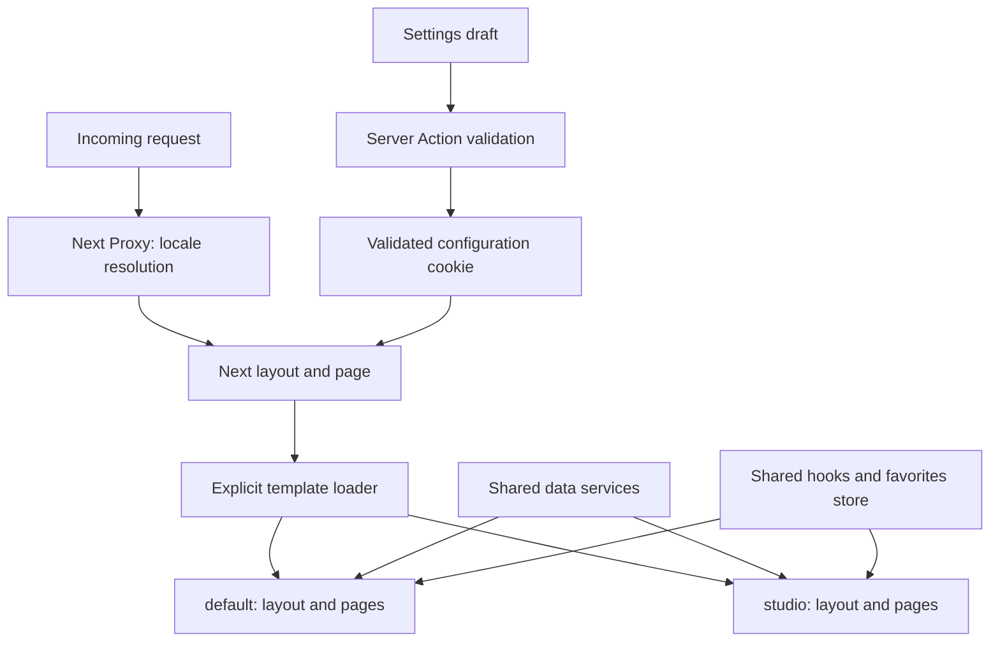

# Architecture

The project uses Next.js for routing and rendering, while keeping a template-oriented organization: template contracts and orchestration live in `src/templates`; each visual implementation lives in the root `templates` directory. Shared React hooks live in `src/composables`, data in `src/services`, state in `src/stores`, and translations in `src/i18n`.

## Request and configuration contract

`SiteConfig` is versioned and small enough for a cookie. Its fields select a registered template, palette, light/dark appearance, optional accent override, default locale, home section order, navigation order/visibility and navigation position. All inputs are validated against explicit allowlists. Invalid read data falls back to defaults; invalid writes return an error. Arrays are copied so defaults cannot be mutated across requests.

The HttpOnly cookie is a local visitor preference, not an account, permission, tenant database, secret or shared administrative setting. It expires after one year. A new browser has independent settings. To make configuration shared across users later, replace the server configuration reader with a service and add authentication to writes. Keep the public `SiteConfig` interface stable.

Language priority: explicit supported URL segment, then valid saved default, then Accept-Language, then Traditional Chinese. Legacy Chinese locale URLs redirect to Traditional Chinese. Supported and legacy locale tags canonicalize case-insensitively. Language links retain path and search parameters. Selecting the default language in settings does not silently replace a language explicitly requested in a URL.

## Server and client boundaries

The server validates configuration, chooses a template from explicit imports, sets body attributes and CSS variables, and supplies the initial localized content. No browser-only theme detection is required for the first render. Reading request cookies makes these pages request-rendered; this application requires a Next.js server and does not support static export to GitHub Pages.

The settings form owns a local draft. Saving uses a Server Action, validates on the server, sets the cookie, revalidates the layout and redirects to the configured default language. Navigation, refresh and first HTML therefore use the same state.

The shared favorites store is created per provider. Browser storage is hydrated after mount, with a loading state, to prevent mismatching server HTML or sharing a user's state between requests. Search and category are URL state; template components never own independent copies of business rules.

## Tailwind 4 and CSS isolation

The global CSS imports Tailwind once and defines semantic utilities with `@theme inline`. Template variable files are scoped by `data-template`, shared palettes by `data-theme`, and appearance by `data-mode`. A validated optional accent is set as an inline CSS variable. Focus outlines and primary-control borders use the theme ink instead of the custom accent, retaining visible boundaries for white or black accent choices. Template layouts use CSS Modules for geometry; shared UI uses semantic Tailwind utilities. Avoid importing Tailwind separately for every template or adding unscoped `body` rules inside a template.

## Adding a template

1. Add the name and metadata in `src/templates/types.ts` and `src/templates/configs.ts`.
2. Create `templates/<name>/layouts/Default.tsx`, `pages/Home.tsx`, `pages/Catalog.tsx`, and scoped styles.
3. Implement `TemplateModule` from `src/templates/view-types.ts`. Consume the shared localized data and hooks rather than copying search/favorite logic.
4. Register an explicit loader in `src/templates/index.ts`. The type contract requires every page slot.
5. Import scoped token CSS into the main style entry and add English/Chinese display names in the dictionaries.
6. Exercise settings save, first-render cookie configuration, deep links, language changes, shared favorites and mobile navigation.

Next owns the route table; templates supply presentation slots. Adding a page means adding one Next route and extending the shared slot contract where the presentation differs.

## Demo content and limits

All project entries are fictional portfolio examples and all illustrations are local geometric artwork. No reference-project business APIs, brand files or assets are included. Search uses local data, favorites use localStorage, and configuration uses a cookie. These mechanisms intentionally demonstrate architecture without a remote backend.
